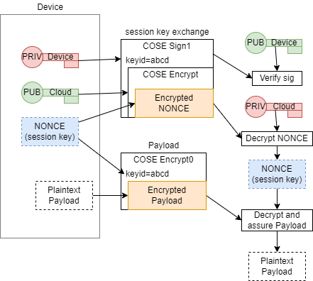

# Flow of data through the system.

Through processes described in the rest of the documentation, the following
private keys and certificates will be generated:

- Device private.  This is a private key generated by the device.
- Device certificate.  This is a certificate, signed by the device private key
  as well as the CA key.  This certificate is publicly known.
- Cloud private.  This private key is generated externally and kept
  private within the cloud service that consumes messages.
- Cloud certificate.  This certificate, signed by the CA, will be
  given to the device.

The overall flow follows the following model:

## The initial message

In order to begin communicating secure payload, the device must create
a secret key (the session key or NONCE in the diagram).  This must be
securely generated from a good source of pseudorandom data.

This will be wrapped in a COSE Encrypt message, encrypted using the
Cloud Public key, so that the cloud service can decrypt it.  This
message is then wrapped in a COSE Sign1 message, signed by the devices
private key.  This ensures integrity of this, and that it came from
this device.

Included in the message must be a 'keyid' COSE protected header that
indicates a unique value for this particular key.  The device should
try to make this unique, using either a timestamp, if it has a notion
of time, or a non-decreasing integer value.

The payload data itself will be encrypted using COSE Encrypt0.  The
keyid should match the above message to match which NONCE/session key
has been used.  The Encrypt0 message provides both encryption and data
integrity, to ensure the payload is correctly communicated.

If neceesary, it is also possibly to embed a sequence number in the
protected header of this message.  (TODO: What COSE value should be
used).

## MQTT

The Sign1(Encrypt(nonce)) message should be sent with a QoS of
"exactly once".  This is more expensive through the MQTT
infrstructure, but ensures that the message has been delivered, and
that the cloud service will be able to decrypt any subsequent
messages.

The actual payload messages can be delivered with "at most once" QoS,
or with "at least once", depending on the significant of the payload.
If there is a sequence number, this can be used to remove duplicated
messages, and because the sequence number will be in a protected
header, it will not be subject to tampering, or replay.

## Future ideas.

Current proposals for `t_cose` patches to support encryption will
require the above protocol.  Future versions may allow the implied
content encryption key negotiated within the COSE Encrypt payload to
be reused for subsequent Encrypt0 message.  In this case, the Encrypt
can code a blank payload, and the NONCE does not need to be explicitly
handled.
